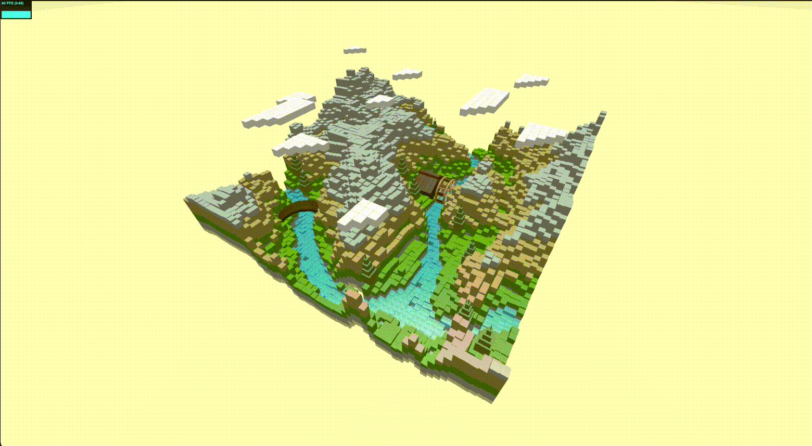
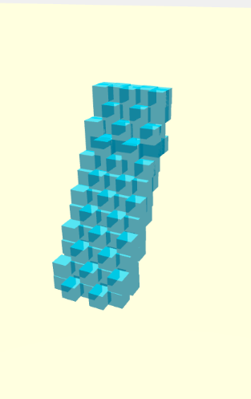
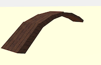
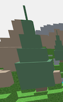
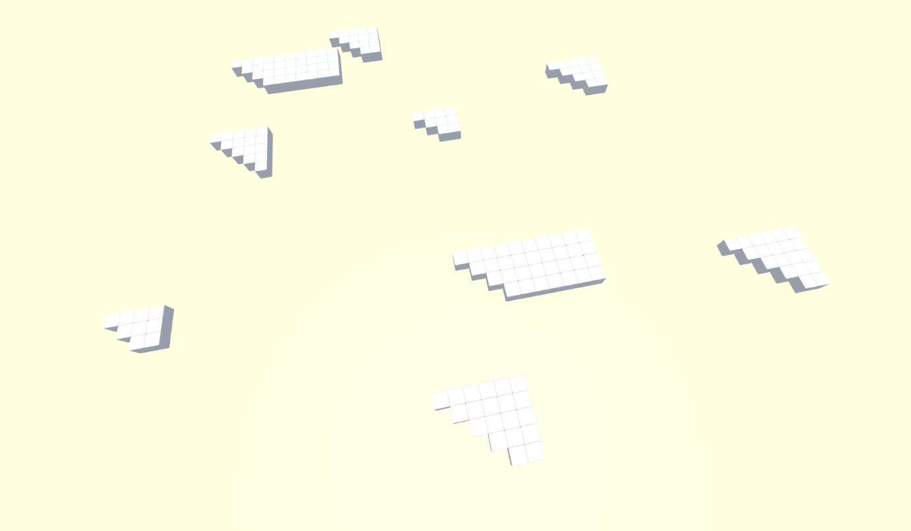
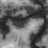

# Fiume - Primo progetto di Interactive 3D Graphics

### Studente:
- Luca Andaloro - 151316

## Descrizione:

L'intero progetto si basa, come da consegna, nel costruire una scena esclusivamente composta da cubi. 
L'idea è stata quella di creare un ambiente naturale composto da montagne, fiume, vegetazione e una cascata.
Inizialmente è stato costruito il terreno con una heightmap (spiegherò nel dettagli nela sezione "terreno"), ed sono stati aggiunti diversi elementi tra cui: 
- Mulino: La casa è stata costruita tramite parallelepipedi. La ruota che compone il mulino è stata creata cambiando il pivot gli elementi che la compongono così da farli posizionare intorno al perno centrale. 

- Cascata: E' composta da due file di cubi per creare un senso di profondità, sono stati posizionati in modo non allineato così da creare il disordine dell'acqua. 

- Ponte: E' composto da parallelepipedi con angolazioni diverse così da formare un arco. 

- Alberi: Compositi da un tronco e box sovrapposti per simulare l'aspetto di un pino. 

- Nuvole: Sono state ideate per essere tutte diverse tra loro, composte da diversi cubi. 

## Terreno:

Il terreno è stato generato tramite la seguente Heightmaps: 
  
La foto è stata ritoccata con photoshop per aggiustare la tonalità in alcuni parti (es. la zona dove è stat posizionato il mulino).
Nelle prima fasi si sono prese in considerazioni diverse opzioni per il posizionamento dei cubi in particolare: 
1. Mantenere una solo fila di cubi (PROBLEMA: con dislivelli ampi si creavano troppi spazi vuoti);
2. Creare cubi allungati (Funzionale non bella esteticamente)
3. Posizionare tanti cubi sovrapposti (PROBLEMA: Il progetto risultava molto pesante e lento, vedere: [Ottimizzazione](https://github.com/Interactive3DGraphicsCourse-UNIUD-2020/cubes-lucaandaloro/tree/sviluppo#ottimizzazione) ).  

E' stata scelta la terza opzione perchè (come già detto) esteticamente la migliore per gestire diversi strati di materiale. In fine è stato studiato un modo per assegnare in base all'altezza e alla posizione il materiale al singolo cubetto.

## Ottimizzazione:

Si è dedicato molto tempo per ottimizzare la parte prestazionale del progetto. Come spiegato nel diario, dopo diverse prove si è deciso di costruire l'intero terreno sovrapponendo diversi cubetti (1X1X1) per poter gestire meglio gli strati del terreno. Utilizzando questa tecnica il numero di cubi è tuttavia aumentato esponenzialmente, quindi per ottimizzare al meglio il progetto si è deciso di non aggiungere alla scena i singoli cubi ma di inserirli all'interno di un array (suddivisi per tipologia del terreno) effettuando un merge finale; così facendo si effetua una sola mesh e un solo add per ogni tipo di terreno. Dopo tali modifiche, l'intero progetto è diventato più leggero da aprire e da visionare mantendo quasi sempre un fps a 60 a parte quando viene effettuato uno zoom elevato. 
La stessa tecnica è stata utilizzata per la creazione della cascata. 
E' stato preso in considerazione anche la possbilità di eliminare le facce dei cubi non visibili ma dal momento che il progetto risultava abbastanza fluido si è deciso di dedicare tempo ad altri dettagli.

## Sviluppi futuri:

Il progetto potrebbe essere ampliato aggiungendo molte nuove animazioni, come l'animazione della cascata e del fiume e migliorare la gestione delle luci creando scenari di giorno e notte con qulahce punto di luce notturno come per esempio un fuoco.

## Struttura:

* `./index.html` -> File principale dove vengono richiamate tutte le funzioni per la creazione degli elementi
* `./README.md` -> File che si sta consultando e contiene una breve descrizione del progetto
* `./journal.md` -> Diario giornaliero dei lavori e test svolti
* **`./js`** -> Contiene tutti i file js del progetto
  * `./js/terreno.js` -> Crea la base di tutto il progetto, creando il terreno partendo da un heightmap (scala di grigi) e aggiunge gli alberi in modo automatico
  * `./js/mulino.js` -> Crea l'intero mulino partendo dalla struttura della casa
  * `./js/cascata.js` -> Aggiunge una cascata "irregolare" in una posizione specifica della scena
  * `./js/ponte.js` -> Aggiunge un ponte ad "arco" (composto sempre da rettangoli) in una posizione specifica della scena
  * `./js/albero.js` -> Contiene la struttura dell'albero che poi viene richiamato da `./js/terreno.js` 
  * `./js/materiali.js` -> Contiene tutti i materiali di tutto il pregetto che vengono richiesti tramite la funzione `getMateriale()`
  * `./js/nuvole.js` -> Genera le nuvole
    * `./js/test` -> Questa cartella contiene file di test o soluzioni alternative per alcuni elementi
* **`./textures`** -> Contiene tutte le texture utilizzate nel progetto
* **`./heightmaps`** -> Contiene la heightmap utilizzata per generare il terreno

## Strumenti Utilizzati
- **Software**
  - VS Code
  - Safari
  - Photoshop
  - GitHub Desktop

- **Hardware:**
  - Portatile: MacBook Pro (15-inch, 2018)
  - CPU: 2,6 GHz Intel Core i7 6 core
  - Scheda grafica: Radeon Pro 560X 4 GB / Intel UHD Graphics 630 1536 MB
  - RAM: 16 GB 2400 MHz DDR4

