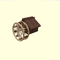

# Cubes - 3Dint First Project

### Studente:
- Luca Andaloro - 151316

## Descrizione:

L'intero progetto si basa, come da consegna, nel costruire una scena esclusivamente composta da cubi. 
L'idea è stata quella di creare un ambiente naturale composto da montagne, fiume, vegetazione e una cascata.
Inizialmente è stato costruito il terreno con una heightmap (spiegherò nel dettagli nela sezione "terreno"), ed sono stati aggiunti diversi elementi tra cui: 
- Mulino: 
- 
- Cascata:
- Ponte: 
- Alberi:
- Nuvole: Quindi ho deciso di creare una versione più semplificata, ho creato nuvole di diverse dimensioni e diverse altezze

## Terreno:

// Foto Heigtmops 
// dire che l'ho modificata con photoshop
//dire dei diversi colori
//dire le opzioni bassa, alta o con tanti cubi

## Ottimizzazione:

Si è dedicato molto tempo per ottimizzare la parte prestazionale del progetto. Come spiegato nel diario, dopo diverse prove si è deciso di costruire l'intero terreno sovrapponendo diversi cubetti (1X1X1) per poter gestire meglio gli strati del terreno. Utilizzando questa tecnica il numero di cubi è tuttavia aumentato esponenzialmente, quindi per ottimizzare al meglio il progetto si è deciso di non aggiungere alla scena i singoli cubi ma di inserirli all'interno di un array (suddivisi per tipologia del terreno) effettuando un merge finale; così facendo si effetua una sola mesh e un solo add per ogni tipo di terreno. Dopo tali modifiche, l'intero progetto è diventato più leggero da aprire e da visionare mantendo quasi sempre un fps a 60 a parte quando viene effettuato uno zoom elevato. 
La stessa tecnica è stata utilizzata per la creazione della cascata. 
E' stato preso in considerazione anche la possbilità di eliminare le facce dei cubi non visibili ma dal momento che il progetto risultava abbastanza fluido si è deciso di dedicare tempo ad altri dettagli.

## Struttura:

* `./index.html` -> File principale dove vengono richiamate tutte le funzioni per la creazione degli elementi
* `./README.md` -> File che si sta consultando e contiene una breve descrizione del progetto
* `./journal.md` -> Diario giornaliero dei lavori e test svolti
* **`./js`** -> Contiene tutti i file js del progetto
  * `./js/terreno.js` -> Crea la base di tutto il progetto, creando il terreno partendo da un heightmap (scala di grigi) e aggiunge gli alberi in modo automatico
  * `./js/mulino.js` -> Crea l'intero mulino partendo dalla strttura della casa
  * `./js/cascata.js` -> Aggiunge una cascata "irregolare" in una posizione specifica della scena
  * `./js/ponte.js` -> Aggiunge un ponte ad "arco" (composto sempre da rettangoli) in una posizione specifica della scena
  * `./js/albero.js` -> Contiene la struttura dell'albero che poi viene richiamato da `./js/terreno.js` 
  * `./js/materiali.js` -> Contiene tutti i materiali di tutto il pregetto che vengono richiesti tramite la funzione `getMateriale()`
  * `./js/nuvole.js` -> Genera le nuvole
    * `./js/test` -> Questa cartella contiene file di test o soluzioni alternative per alcuni elementi
* **`./textures`** -> Contiene tutte le texture utilizzate nel progetto
* **`./heightmaps`** -> Contiene la heightmap utilizzata per generare il terreno

## Strumenti Utilizzati
- **Software**
  - VS Code
  - Safari
  - Photoshop
  - GitHub Desktop

- **Hardware:**
  - Portatile: MacBook Pro (15-inch, 2018)
  - CPU: 2,6 GHz Intel Core i7 6 core
  - Scheda grafica: Radeon Pro 560X 4 GB / Intel UHD Graphics 630 1536 MB
  - RAM: 6 GB 2400 MHz DDR4

